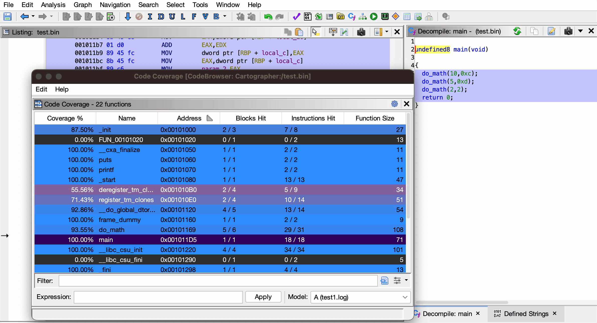
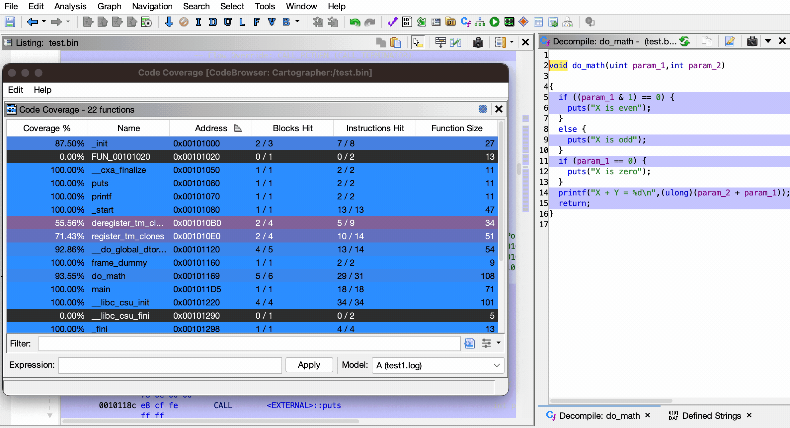
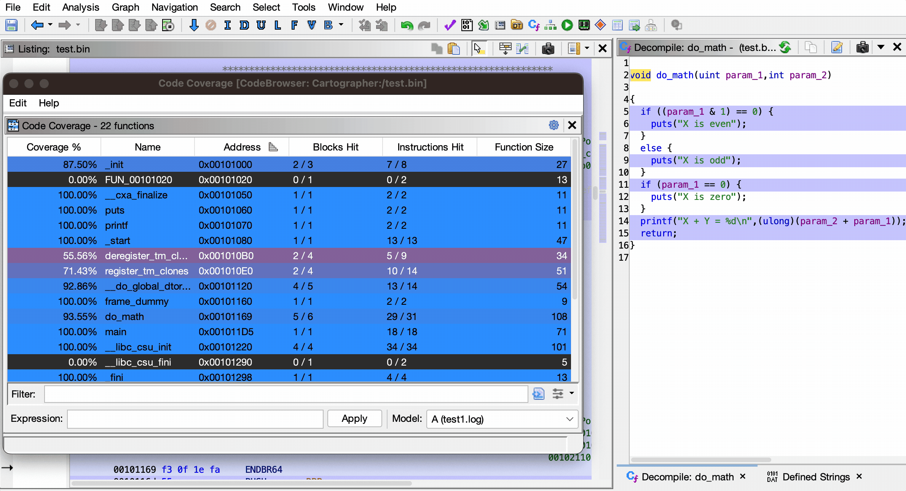

<h1 align="center">Cartographer</h1>

<h3 align="center">Mapping Out Code Coverage</h3>

<p align="center">
    <a href="https://github.com/nccgroup/Cartographer/releases/latest"></a>
    <a href="https://github.com/nccgroup/Cartographer/actions"></a>
    <a href="LICENSE"></a>
    <br>
    
    
    
</p>

Developed by Austin Peavy - https://github.com/aus10pv

Released as open source by NCC Group Plc - https://www.nccgroup.com/  
Released under the Apache 2.0 license (see [LICENSE](LICENSE) for more information)


## Description

Cartographer is a code coverage mapping plugin for Ghidra, enabling researchers to observe which parts of a program have been executed without requiring source code.

## Table of Contents

- [Key Features](#key-features)
- [Installation](#installation)
  - [Loading the Plugin](#loading-the-plugin)
- [Usage](#usage)
  - [Loading Code Coverage Files](#loading-code-coverage-files)
  - [Code Coverage Details](#code-coverage-details)
  - [Swapping Between Coverages](#swapping-between-coverages)
  - [Expression Parser](#expression-parser)
    - [Syntax](#syntax)
    - [Examples](#examples)
- [Contributing](#contributing)
  - [Building from Source](#building-from-source)
  - [Reporting Bugs](#reporting-bugs)
- [Credits](#credits)

# Key Features

* Colorizes executed code
  * Function Graph
  * Disassembly (Listing) View
  * Decompiler View
* Fully customizable colors
* Supports Ghidra themes
* Loads DRCOV files and custom EZCOV files
  * See [EZCOV.md](EZCOV.md) for details on the EZCOV format
* Provides a detailed overview of function coverage
  * Includes heat map showing how much of each function was executed
* Easily swap between loaded coverage files
* Search for functions by name
* Filter results by coverage amount and more
* Powerful expression parser
  * Perform logical operations on multiple loaded coverages
* Supports coverage in different address spaces

# Installation

The latest stable version of Cartographer can be downloaded from the [Releases](https://github.com/nccgroup/Cartographer/releases/latest) page.

## Loading the Plugin

1. Launch Ghidra.
2. Navigate to the Install Extensions window.
   * `File` -> `Install Extensions...`
3. Click the green "+" icon at the top-right corner.
4. Select the downloaded ZIP file to load the plugin into Ghidra.
5. Click the "OK" button to exit the Install Extensions window.
6. Restart Ghidra when prompted.

# Usage

Once the plugin is loaded, there will be additional controls in the CodeBrowser window for working with code coverage data.

## Loading Code Coverage Files

Code coverage files can be loaded via the Tools menu: `Tools` -> `Code Coverage` -> `Load Code Coverage File(s)...`

When a code coverage file is loaded, all of the coverage data is immediately highlighted in the **Listing** view and the **Decompiler** view.


## Code Coverage Details

Detailed information about the coverage data for each function can be found within the **Code Coverage** window.

The Code Coverage window can be opened by navigating to `Window` -> `Code Coverage`, or by pressing `Ctrl-Shift-C` on Windows (`Cmd-Shift-C` on Mac).

This window shows various details about each function in the program:

* **Coverage %**: Percentage of the function that was executed
* **Name**: Name of the function
* **Address**: Address (entry point) of the function
* **Blocks Hit**: Number of basic blocks executed
* **Instructions Hit** Number of instructions executed
* **Function Size**: Size of the function in bytes

Clicking on any function will navigate to the specified function in the Listing view and Decompiler view.


## Searching and Filtering

The **Filter** input box can be used to search for a function by name.

Any of the data displayed in the coverage table can be used as a column filter.



## Swapping Between Coverages

The dropdown at the bottom-right of the Code Coverage window can be used to quickly and easily swap between loaded code coverage files.



## Expression Parser

The text box at the bottom of the Code Coverage window can be used to perform logical operations on loaded code coverage files.

This can be **extremely** useful for examining differences and similarities between different runs of a program.



### Syntax

Below are the logical operators that can be used within the expression parser.

* `&`: Gets **only** the code executed by **both** coverages
* `|`: Gets **any** code executed by **either** coverages
* `^`: Gets **only** the executed code that **differs** between the coverages
* `-`: Gets **only** executed code which is **unique** to the left-hand coverage

Coverages are referenced by their alphabetical IDs in the dropdown menu, such as `A`, `B`, `XY`, etc.

Each logical operation is grouped using parentheses, and expressions can be of any length or complexity.

### Examples

1. Show the code that was executed in **both** coverages `A` and `B`:
   ```
   A & B
   ```
   
2. Show the executed code that was **different** between coverages `A` and `B`:
   ```
   A ^ B
   ```
   
3. Show code that was **only** executed in `B`:
   ```
   B - A
   ```

4. Combine **all** of the coverage data found in `A` and `B`, then find any **differences** from `C`:
   ```
   (A | B) ^ C
   ```

# Contributing

## Building from Source

Gradle can be used to build Cartographer from its source code.

1. Clone the Cartographer GitHub repository.
   ```
   $ git clone https://github.com/nccgroup/Cartographer.git
   ```

2. Enter the repository and build with gradle.
   ```
   $ cd Cartographer
   $ gradle -PGHIDRA_INSTALL_DIR=<ghidra_install_dir>
   ```
   * Replace `<ghidra_install_dir>` with the path to your local Ghidra installation path.

3. After building, the plugin ZIP file will be located in the `dist/` folder.

## Reporting Bugs

If you've found a bug in Cartographer, please open an issue via [GitHub](https://github.com/nccgroup/Cartographer/issues/new/choose).

# Credits

Originally inspired by Lighthouse - https://github.com/gaasedelen/lighthouse
